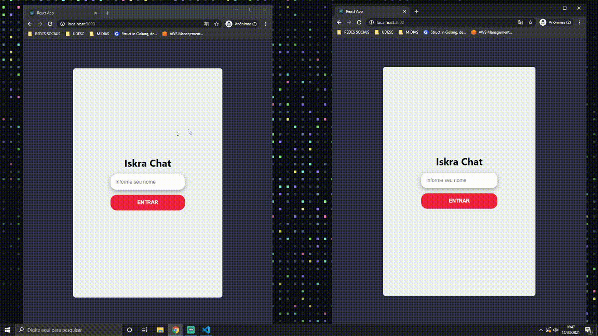

# ISKRA CHAT 🔥
Webchat em tempo real com NodeJS, Socket.io e React

## Para trabalhar com este projeto você precisa ter:
    - Docker
    - Node
    - Yarn

## Setup - BACKEND
    - Dê um `git clone` do projeto para sua máquina;
    - Abra com o terminal a pasta 'backend/' e rode um `yarn install` para instalar as dependências;
    - Para levar o banco de dados rode o comando `docker-compose up` caso deseje que Docker rode em segundo plano rode `docker-compose up -d`;
    - Em outro terminal, dentro da pasta 'backend/', rode o comando `yarn sequelize db:create` para criar o banco de dados e `yarn sequelize db:migrate` para criar as tabelas;
    - Após o banco estar pronto, rode `yarn dev` para iniciar a API;

## Setup - FRONTEND
    - Abra o terminal na pasta 'frontend/' e rode o comando `yarn install`;
    - Após instalar as dependências, rode o comando `yarn start` para inicializar o projeto;

